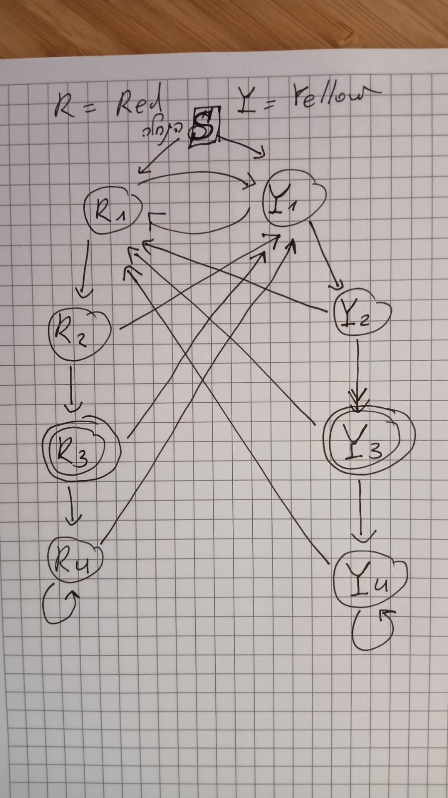

# State Machine Framework
An experiement with state machine modeling



## install
`pip3 install -e .`

## run test
`python3 -m unittest tests.test_machine`

## Usage 

- **States** and **Events** can be any object.
- If state is a `callable` object, then it will be triggered to call side effects.
- You use states as nodes and events as edges.

Use the `add(from_state: object, event: object, to_state: object)` method of `Machine` class to model the state machine.


```python
from machine.machine import Machine

m = Machine("Start")

m.add("Start", "red", "R1") \
 .add("Start", "yellow", "Y1") \
 .add("R1", "red", "R2") \
 .add("R1", "yellow", "Y1") \
 .add("R2", "red", "R3") \
 .add("R2", "yellow", "Y1") \
 .add("R3", "red", "R4") \
 .add("R3", "yellow", "Y1") \
 .add("R4", "red", "R4") \
 .add("R4", "yellow", "Y1") \
 .add("Y1", "red", "R1") \
 .add("Y1", "yellow", "Y2") \
 .add("Y2", "red", "R1") \
 .add("Y2", "yellow", "Y3") \
 .add("Y3", "red", "R1") \
 .add("Y3", "yellow", "Y4") \
 .add("Y4", "red", "R1") \
 .add("Y4", "yellow", "Y4")
```

Then, you can iterate a list of events with

```python
for state in m.iterate_input(['red', 'yellow', 'red', 'yellow', 'red', 'yellow', 'red', 'yellow']):
    print(state)

# prints: R1, Y1, R1, Y1, R1, Y1, R1, Y1
```